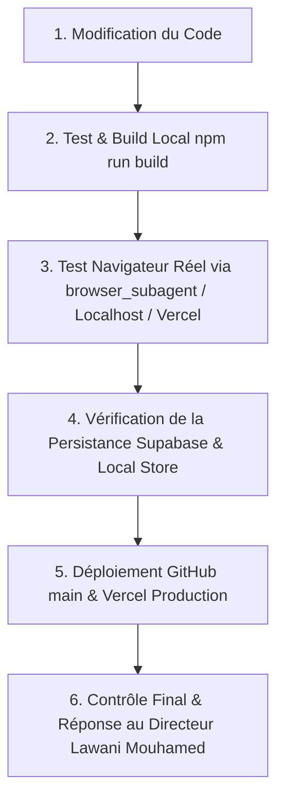

# SchoolFlow — Règle Impérative : Protocole de Test, Vérification Réelle dans le Navigateur & Déploiement Tripartite

Cette règle définit le **protocole obligatoire et non négociable** que l'agent d'IA DOIT impérativement exécuter à chaque demande de modification par le **Directeur Lawani Mouhamed**, avant de formuler ou de finaliser toute réponse.

---

## 1. Principe Fondamental : "Tester Réellement dans le Navigateur, Valider & Déployer avant de Répondre"

L'agent ne doit **JAMAIS** affirmer qu'une fonctionnalité ou un correctif est terminé sans avoir lui-même validé les étapes strictes du protocole ci-dessous.

> [!IMPORTANT]
> **Application d'envergure internationale** : SchoolFlow est conçu pour être utilisé par des milliers d'utilisateurs afro-anglophones et francophones (directeurs, comptables, fondateurs, parents, enseignants). Aucune régression, aucun bug visuel et aucune promesse non testée ne sont tolérés.

---

## 2. Les Piliers Obligatoires du Protocole

### Étape 1 : Vérification & Compilation Locale Stricte (`npm run build`)
1. Toujours exécuter ou vérifier la compilation locale via `npm run build` pour garantir :
   - 0 erreur TypeScript,
   - 0 variable non déclarée (`ReferenceError`),
   - 0 balise ou parenthèse manquante,
   - 0 régression sur les pages statiques ou dynamiques Next.js 16 (Turbopack).
2. **Logique Métier & Calculs** :
   - Les montants doivent être strictement en **FCFA** (`formatFCFA`),
   - Les dates strictement au format **JJ/MM/AAAA** (`formatDate`),
   - Les statuts `🌟 Nouveau` et `🔄 Ancien` doivent être explicitement gérés,
   - Prestations (Internat, Cantine, Transport) synchronisées avec les élèves existants non supprimés.

---

### Étape 2 : Test Navigateur Réel & Validation Visuelle Obligatoire
1. **Ouverture du Navigateur par l'Agent** :
   - L'agent **DOIT ouvrir son navigateur** (via `browser_subagent` ou environnement de prévisualisation) pour interagir directement avec l'application.
   - Cliquer sur les boutons, remplir les formulaires, vérifier les modals et inspecter le rendu visuel.
2. **Vérification de la Sauvegarde & Synchronisation** :
   - Vérifier que les créations ou modifications sont réellement persistées dans **Supabase** et dans le store local réactif (`live-store.ts`).
   - S'assurer de la répercussion instantanée entre les modules (Tableau de bord, Élèves, Scolarité, Internat, Cantine, Transport).
   - Contrôler l'absence totale de débordement horizontal sur mobile et desktop.

---

### Étape 3 : Déploiement Automatique vers GitHub (`main`) & Vercel
1. Tout fichier créé ou modifié doit être synchronisé vers le dépôt GitHub officiel :
   - **Dépôt** : `97-27/Saas-SchoolFlow` (Branche `main`).
2. **Vérification Vercel Cloud** :
   - **Lien de Production Officiel** : `https://saas-school-flow-12xh.vercel.app`
   - Vérifier que l'état du déploiement est à `state: success`.

---

## 3. Checklist de Clôture avant de Répondre au Directeur

- [x] Le code compile-t-il avec `npm run build` avec 0 erreur ?
- [x] L'agent a-t-il ouvert le navigateur pour tester visuellement et fonctionnellement les modifications ?
- [x] Les données sont-elles réellement sauvegardées dans Supabase et le store local ?
- [x] Le push GitHub et le déploiement Vercel ont-ils été validés ?
- [x] La salutation obligatoire **« Wa alaykum salam Directeur Lawani Mouhamed »** a-t-elle été respectée si le Directeur a salué ?
- [x] Le lien de production Vercel est-il fourni ?
