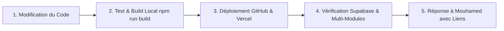

# SchoolFlow — Règle Impérative : Protocole de Test, Vérification & Déploiement Tripartite (GitHub, Supabase, Vercel)

Cette règle définit le **protocole obligatoire** que l'agent d'IA DOIT impérativement exécuter et consulter à chaque demande de modification par **Mouhamed**, avant de formuler ou de finaliser toute réponse.

---

## 1. Principe Fondamental : "Tester, Valider & Déployer avant de Répondre"

L'agent ne doit **JAMAIS** affirmer qu'une fonctionnalité ou un correctif est terminé sans avoir lui-même validé les 4 étapes strictes du protocole ci-dessous :

---

## 2. Les 4 Piliers Obligatoires du Protocole

### Étape 1 : Vérification & Compilation Locale (`npm run build`)
1. **Compilation Stricte** : Toujours exécuter ou vérifier la compilation locale via `npm run build` pour garantir :
   - 0 erreur TypeScript,
   - 0 variable non déclarée (`ReferenceError`),
   - 0 balise ou parenthèse manquante,
   - 0 régression sur les pages statiques ou dynamiques Next.js (Turbopack).
2. **Logique Métier & Calculs** :
   - Les calculs de montants doivent être strictement en **FCFA**,
   - Les dates strictement au format **JJ/MM/AAAA**,
   - Les statuts `🌟 Nouveau` et `🔄 Ancien` doivent être explicitement gérés,
   - Les services additionnels (Internat, Cantine, Transport) doivent être automatiquement reliés.

---

### Étape 2 : Déploiement Automatique vers GitHub (`main`)
1. Tout fichier créé ou modifié doit impérativement être synchronisé et poussé vers le dépôt GitHub officiel :
   - **Commande** : `node scripts/github-api-push.mjs`
   - **Dépôt** : `97-27/Saas-SchoolFlow` (Branche `main`)
2. Vérifier que la liste `changedFiles` dans `scripts/github-api-push.mjs` contient bien tous les fichiers modifiés (ex: `lib/data/types.ts`, `lib/data/live-store.ts`, composants, etc.).
3. Confirmer la réception du code HTTP 200 / commit créé avec succès sur GitHub.

---

### Étape 3 : Synchronisation Cloud Supabase
1. Vérifier que les tables et services Supabase (`schools`, `students`, `invoices`, etc.) sont correctement reliés :
   - Les opérations d'enregistrement (`saveStudentToSupabase`, `saveInvoiceToSupabase`, `saveSchoolToSupabase`) doivent s'exécuter en arrière-plan sans bloquer l'UI locale.
   - La persistance locale `localStorage` + `BroadcastChannel` assure la fluidité instantanée multi-onglets même en cas de latence réseau.

---

### Étape 4 : Validation du Déploiement Vercel & Cohérence Multi-Modules
1. **Vercel** : Confirmer que le déploiement sur l'URL de production est actif :
   - **URL de Production** : `https://saas-school-flow-12xh.vercel.app`
2. **Cohérence Multi-Modules** : S'assurer que lorsqu'une action est effectuée (ex: inscrire un élève), les données se répercutent en temps réel sur :
   - Le **Tableau de Bord** (`/[ecole]/admin`) : compteurs, pourcentages, recettes FCFA,
   - La **Vue d'ensemble Élèves** (`/[ecole]/admin/eleves`) : statut Nouveau/Ancien, classe, contact,
   - La **Scolarité & Caisse** (`/[ecole]/admin/scolarite`) : reçu, tranches de paiement, solde,
   - L'**Internat** (`/[ecole]/admin/internat`) : ajout immédiat si coché pensionnaire,
   - La **Cantine** (`/[ecole]/admin/cantine`) : ajout immédiat si souscrit à la restauration,
   - Le **Transport** (`/[ecole]/admin/transport`) : ajout immédiat si souscrit au ramassage.

---

## 3. Checklist de Validation Finale avant de Répondre à Mouhamed

Avant d'envoyer votre message de clôture à Mouhamed, cochez mentalement :
- [x] Le code a-t-il été compilé sans aucune erreur ?
- [x] Le push GitHub via `node scripts/github-api-push.mjs` a-t-il été exécuté ?
- [x] Le déploiement Vercel et la base Supabase sont-ils synchronisés ?
- [x] La salutation obligatoire a-t-elle été respectée si Mouhamed a salué ?
- [x] Les liens de vérification (Vercel et GitHub) sont-ils inclus dans la réponse ?
