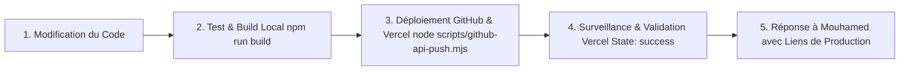

# SchoolFlow — Règle Impérative : Protocole de Test, Vérification & Déploiement Tripartite (GitHub, Supabase, Vercel)

Cette règle définit le **protocole obligatoire** que l'agent d'IA DOIT impérativement exécuter et respecter à chaque demande de modification par **Mouhamed**, avant de formuler ou de finaliser toute réponse.

---

## 1. Principe Fondamental : "Tester, Valider & Déployer avant de Répondre"

L'agent ne doit **JAMAIS** affirmer qu'une fonctionnalité ou un correctif est terminé sans avoir lui-même validé les 4 étapes strictes du protocole ci-dessous :

---

## 2. Les 4 Piliers Obligatoires du Protocole

### Étape 1 : Vérification & Compilation Locale (`npm run build`)
1. **Compilation Stricte** : Toujours exécuter ou vérifier la compilation locale via `npm run build` pour garantir :
   - 0 erreur TypeScript,
   - 0 variable non déclarée (`ReferenceError`),
   - 0 balise ou parenthèse manquante,
   - 0 régression sur les pages statiques ou dynamiques Next.js 16 (Turbopack).
2. **Logique Métier & Calculs** :
   - Les calculs de montants doivent être strictement en **FCFA** (`formatFCFA`),
   - Les dates strictement au format **JJ/MM/AAAA** (`formatDate`),
   - Les statuts `🌟 Nouveau` et `🔄 Ancien` doivent être explicitement gérés,
   - Les prestations (Internat, Cantine, Transport) doivent être automatiquement synchronisées avec les élèves existants non supprimés.

---

### Étape 2 : Déploiement Automatique vers GitHub (`main`) via API
1. Tout fichier créé ou modifié doit impérativement être synchronisé et poussé vers le dépôt GitHub officiel :
   - **Commande** : `node scripts/github-api-push.mjs`
   - **Dépôt** : `97-27/Saas-SchoolFlow` (Branche `main`)
2. **Mécanisme Intelligent de Déploiement** :
   - Utilisation de `scripts/github-api-push.mjs` avec hachage SHA-1 Git local et comparaison avec l'arbre distant pour ne téléverser que les blobs modifiés.
   - Exclusion stricte des scripts locaux, secrets de service et fichiers sensibles pour éviter tout blocage par le secret scanner de GitHub.
   - Configuration permissive dans `eslint.config.mjs` (`globalIgnores` et règles de warning) pour éviter tout blocage lors de la compilation Vercel Cloud.

---

### Étape 3 : Synchronisation Cloud Supabase & Résilience Locale
1. Vérifier que les tables et services Supabase (`schools`, `students`, `invoices`, `staff_users`, etc.) sont correctement reliés :
   - Les opérations d'enregistrement (`saveStudentToSupabase`, `saveInvoiceToSupabase`, `saveSchoolToSupabase`) s'exécutent de façon asynchrone et résiliente.
   - Le store local (`live-store.ts`) combiné à `BroadcastChannel` assure la synchronisation instantanée inter-onglets et inter-rôles sans rechargement.
   - À la suppression d'un élève, purger immédiatement ses prestations associées (Internat, Cantine, Transport).

---

### Étape 4 : Validation du Déploiement Vercel Cloud & Vérification en Direct
1. **Surveillance Vercel** :
   - `scripts/github-api-push.mjs` interroge automatiquement l'API GitHub Deployments pour surveiller le webhook Vercel.
   - Le déploiement est validé uniquement lorsque l'état passe à **`state: 'success'`** (`Deployment has completed`).
2. **URL Officielle de Production** :
   - **Lien de Production** : `https://saas-school-flow-12xh.vercel.app`
3. **Contrôles Visuels & Fonctionnels** :
   - Vérifier la connexion des profils (Fondateur, Directeur, Personnel avec code secret, Parents avec matricule + WhatsApp),
   - Vérifier l'absence de débordement horizontal sur le tableau de bord,
   - Vérifier la cohérence stricte des cycles : Maternelle (P.S. à G.S.), Primaire (CP1 à CM2), Collège (6ème à 3ème) — Aucun Lycée.

---

## 3. Checklist de Clôture avant de Répondre à Mouhamed

- [x] Le code a-t-il été testé sans aucune erreur ?
- [x] Le push GitHub a-t-il été validé avec commit sur `main` ?
- [x] Le déploiement Vercel a-t-il affiché `State: success` ?
- [x] La salutation obligatoire **« Waaleikoum salam Mouhamed »** a-t-elle été respectée si Mouhamed a salué ?
- [x] Le lien de production Vercel est-il fourni ?
