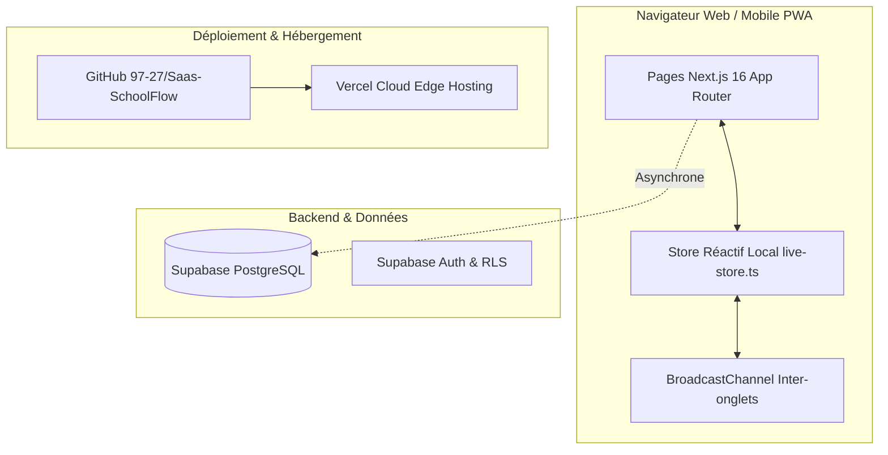

# SchoolFlow Africa — Architecture Système, Stratégies & Workflow Maître

Ce document constitue la référence permanente et intemporelle du projet **SchoolFlow**. Il formalise le fonctionnement complet de l'application, les stratégies produit appliquées, l'architecture logicielle retenue et les protocoles techniques pour pérenniser le développement au fil des années.

---

## 1. Vision, Produit & Marché Cible

### 1.1 Qu'est-ce que SchoolFlow ?
**SchoolFlow** est un progiciel de gestion intégrée (SaaS ERP Scolaire) taillé sur-mesure pour les établissements privés et complexes scolaires d'Afrique (Afrique de l'Ouest, Centrale et Afrique anglophone).

### 1.2 La Problématique Résolue (Pain Points)
* **Gestion sur cahiers et fichiers Excel dispersés** : risques de pertes de données, fraudes sur les encaissements, erreurs de calculs sur les moyennes et soldes d'écolage.
* **Instabilité de la connexion internet** : les solutions cloud classiques bloquent dès qu'une coupure réseau survient dans l'établissement.
* **Complexité des logiciels occidentaux** : inadaptés aux devises (FCFA), aux calendriers scolaires trimestriels africains et aux usages mobiles (WhatsApp prédominant).

### 1.3 Stratégie Produit & Adoption
* **Devise stricte** : Tous les montants financiers sont exprimés en **FCFA** (`formatFCFA`).
* **Format de date universel** : `JJ/MM/AAAA` (`formatDate`).
* **Cycles couverts** : De la **Maternelle (P.S., M.S., G.S.) jusqu'en 3ème** (Primaire CP1-CM2, Collège 6ème-3ème). Pas de lycée dans la configuration cible.
* **Canaux de communication privilégiés** : Génération de reçus PDF/images instantanés et partage direct via **WhatsApp** et **SMS** aux parents d'élèves.

---

## 2. Architecture Technique Globale

### 2.1 Stack Technologique
* **Framework Frontend** : Next.js 16 (Turbopack, App Router).
* **Bibliothèque UI** : React 19 + TypeScript 5.
* **Styling** : Tailwind CSS v4 (Design System épuré "Vert, Blanc, Noir").
* **Iconographie** : Lucide React.
* **Base de données & Persistance Cloud** : Supabase PostgreSQL (`@supabase/supabase-js`).
* **Hébergement Cloud** : Vercel Cloud Platform.
* **Contrôle de version & Déploiement** : Dépôt GitHub `97-27/Saas-SchoolFlow`.

---

## 3. Système Intégré de Synchronisation Hybride (Offline-First / Cloud-Sync)

Pour répondre aux défis de connectivité en Afrique, SchoolFlow repose sur une double motorisation :

### 3.1 Moteur Local Réactif (`live-store.ts`)
* Toute écriture (création d'élève, encaissement de scolarité, pointage de présence, saisie de note) est validée **instantanément à l'écran** sans temps de chargement bloquant.
* Utilisation de l'API navigateur `BroadcastChannel` : lorsqu'un secrétaire enregistre un paiement sur un onglet, le tableau de bord du directeur ouvert sur un autre onglet s'actualise en temps réel sans rafraîchir la page.

### 3.2 Synchronisation Asynchrone Cloud (`lib/supabase/services.ts`)
* En parallèle de la réactivité locale, les transactions sont envoyées de manière résiliente vers Supabase :
  - `saveStudentToSupabase()`
  - `saveInvoiceToSupabase()`
  - `saveSchoolToSupabase()`
  - etc.
* En cas de latence ou d'interruption temporaire d'internet, l'utilisateur continue de travailler sans blocage.

---

## 4. Architecture Multi-Tenant & Hiérarchie des Rôles

### 4.1 Routage Dynamique par Établissement
L'application utilise le segment dynamique `app/[ecole]/...` :
* Chaque école dispose de son espace réservé identifié par son `slug` (ex: `/notre-dame/admin/dashboard`).
* Les données de chaque école sont strictement isolées par `school_id`.

### 4.2 Matrice des Rôles & Accès
1. **Fondateur** : Vision stratégique, chiffre d'affaires global, santé financière, frais d'abonnement.
2. **Directeur** : Pilotage pédagogique et administratif, gestion des inscriptions, classes, enseignants et bulletins.
3. **Comptable** : Encaissement des frais de scolarité, émission des reçus, salaires du personnel, registre des dépenses.
4. **Secrétaire** : Accueil, saisie des élèves, justificatifs administratifs, inscriptions.
5. **Enseignant** : Saisie des notes, cahier de texte, pointage des présences quotidiennes.
6. **Parent** : Consultation du bulletin de notes, suivi des paiements, réceptions d'alertes WhatsApp.

---

## 5. Modules Fonctionnels de SchoolFlow

1. **Tableau de Bord Exécutif (`/dashboard`)** : Chiffre d'affaires collecté, effectifs totaux avec ratio filles/garçons (`♀ F / ♂ M`), taux de recouvrement des écolages.
2. **Gestion des Élèves (`/eleves` & `/inscriptions`)** : Matricules uniques, statut `🌟 Nouveau` vs `🔄 Ancien`, fiche médicale et contacts d'urgence.
3. **Scolarité & Facturation (`/scolarite`)** : Grilles tarifaires par classe, échéanciers mensuels, reçus officiels infalsifiables.
4. **Prestations Annexes** :
   * **Cantine (`/cantine`)** : Régimes, forfaits mensuels, suivi des repas.
   * **Transport (`/transport`)** : Lignes de ramassage, arrêts, abonnements.
   * **Internat (`/internat`)** : Dortoirs, chambres, surveillance nuit.
5. **Pédagogie & Évaluations (`/notes`, `/bulletins`)** : Coefficients par matière, calcul automatique des rangs, moyennes pondérées, impressions de bulletins bilingues.
6. **Ressources Humaines (`/personnel`, `/salaires`)** : Fiches employés, fiches de paie, avances et acomptes.

---

## 6. Protocole Opérationnel de Maintenance & Évolution

Pour toute future modification ou ajout au fil des années, l'équipe d'ingénierie et l'IA appliquent la méthodologie suivante :

1. **Intégrité Métier** : Ne jamais régresser sur le respect du FCFA, du format JJ/MM/AAAA, ou des classes de la maternelle à la 3ème.
2. **Build Turbopack obligatoire** : Validation préalable avec `npm run build` garantissant 0 erreur TypeScript.
3. **Vérification en Direct avec Navigateur Réel** : Tester visuellement l'interface et la persistance avant toute mise en production.
4. **Déploiement Continu** : Push vers la branche `main` de GitHub déclenchant le build de production Vercel.
